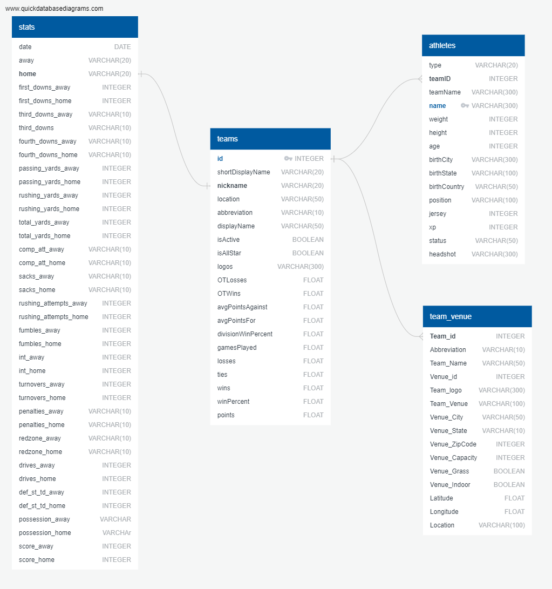

# Touchdown Insights: A Data-Driven NFL Dashboard

## Contributions

This project was created by the following team members:

- Jacob Evans
- Sara Parveen
- Lailah Libay
- Gus Mendes

## Web Links:

Repository: https://github.com/gusmendesbh/project3-group1

GitHub Pages: https://gusmendesbh.github.io/project3-group1/html/teams.html

Flask-AWS: https://flask-service.ofeg1bv1af188.ca-central-1.cs.amazonlightsail.com/index.html

## Project Description 

Football is one of the most popular sports in the world with a large viewing globally. There is a growing need for a platform that could cater for the needs of football enthusiasts and analysts. This project is aimed at creating an interactive dashboard that could serve as a one-point stop for National Football League (NFL) fans seeking information and these are our target audience. Some other people who would be interested in the insights represented on the dashboard such as sports analysts, NFL Sports Agents and Football coaches. The dashboard displays overall Team and Athlete details for the year 2022 and also presents visualizations for teams performance statistics from 2002 onwards to 2023.

## The Dashboard

The interactive dashboard has three views:

1. **Main Dasboard**

    This view is the default view that loads when the dashboard is launched. It displays a static view of some key details of the 2022 game and an interactive map plotting team venues.

    

2. **Teams Dashboard**

    The Teams view has a drodown containing list of all the teams that played in the 2022 season. The dashboard displays team logo, basic team data and results metrics for 2022. It also includes three additional visualizations displaying scores, yards and attempts statistics from 2002 to 2023. The dashboard updates every time a different team is selected from the dropdown.

   

3. **Athletes Dashboard**

    The Athletes view has a drodown containing list of all the athletes that played in the 2022 season. The dashboard displays athletes's headshot and their demographic information which update every time a different athlete is selected from the dropdown. This view also includes two charts showing Height Vs. Weight, and Age vs. Experience statistics of all athletes which remain static.

    

## Data Sources

The data for this project is taken from a combination of web scraping using APIs, CSV and Mapping sources. Following are the key data sources we have used:

- [ESPN API through GitHub](https://gist.github.com/nntrn/ee26cb2a0716de0947a0a4e9a157bc1c)

    This link contains NFL API endpoints which contain 2022 data only. We mainly used the Athletes and Teams endpoints to get informative and overall statistics data.

- [Kaggle dataset](https://www.kaggle.com/datasets/cviaxmiwnptr/nfl-team-stats-20022019-espn?resource=download) 

    The Kaggle dataset was downloaded as CSV and it contains detailed match statistics for teams from 2002 to 2023. The CSV has 5642 rows and 39 columns.

- [GeoPy](https://geopy.readthedocs.io/en/stable/)

    This was used for geocoding and getting latitude and longitude information for team venues.

Following are some other data sources which were consulted and reviewed to get ideas about the required data:

- [ProFootball Reference](https://www.pro-football-reference.com/)
- [GitHub ESPN API Endpoints](https://gist.github.com/akeaswaran/b48b02f1c94f873c6655e7129910fc3b#nfl)
- [Covers](https://www.covers.com/picks/nfl)

## Project Workflow

The team members collaborated on different steps of the project to optimize the workflow. Some steps were completed by working together and the others were assigned to each teammate to make best use of the available resources and time.

Following are some of the key steps that were involved in building the dashboard:

### **Step 1: Extract, Transform, Load (ETL) Data**

The data was scraped from ESPN API using *requests*. We reviewed the available data and only extracted the key-value pairs that we needed. For loops were used to loop create URLs for each team. There were a total of 32 teams. 

Similar methodology was used to extrach athletes data from the API by using embedded loops. There were three categories of athletes: offensive, defensive and special. The extracted data included the player type to use for filtering when needed. This created a total of 2158 records.

The statistics data was loaded using the CSV file which is saved in [Resources folder](data/Resources/).

The team venue data was created by scraping data from ESPN API and merging it with location coordinates extracted using GeoPy. This created 32 records in total each corresponding to the 32 teams that participated in 2022 NFL season.

All the extracted data was converted to Pandas Dataframes. This was then saved to [CSV](data/Outputs_CSV/) and [JSON](data/Outputs_JSON/) formats to be able to use for creating the visualizations later. The extraction and transformation process is documented in the Jupyter Notebooks stored in [python](python/) folder.

### **Step 2: Create the Database**

An ERD is created for the databse using [QuickDBD](https://www.quickdatabasediagrams.com/).

An SQL database is then created using SQL, specifically PostgreSQL to load the data for easy retrieval and manipulation. The CSV files were imported into the tables created in the SQL. 

### **Step 3: Create the HTML/CSS**

HTML and CSS is developed by taking inspiration from a template on [bootstrap](https://bootstrapmade.com/website-templates/). The template was customized to fulfill the needs of crerating the NFL Dashboard by personalizing the HTML and CSS.

HTM was used to integrate the data retrieval and manipulation logic into the UI using JavaScript mainly.

### **Step 4: Create the visualizations using JavaScript**

Three [JavaScript files](js/) are developed to create visualizations for the dashboard.

- The Main dashboard has visualizations created using [D3](https://d3js.org/) and [Leaflet](https://leafletjs.com/) library. The interactive map was created data extracted from GeoPy mainly.  

- The Teams and Athletes dasboards have visualizations created using [D3](https://d3js.org/) and [Highcharts](https://www.highcharts.com/). **Highcharts** is a new JS library which was not covered during class.     

### **Step 5: Setup the Python Flask app**

In order to deploy the dashboard to web, we created a Python Flask application. In the Flask application, a few routes were added to display teams and athletes’ pages depending on the requested URL. A debugger was also included when running the application in development mode to enable quick identification and fixing of errors. 

### **Step 6: Deployment to Aamazon Web Services (AWS)**

After developing the Flask app, we deployed it to AWS. It is also deployed to GitHub Pages. Following are the links to access it on AWS and GitHub:

- https://flask-service.ofeg1bv1af188.ca-central-1.cs.amazonlightsail.com/index.html

## Conclusion

This was a very challenging project for all the team members and it gave us a lot of opportunities to learn new skills and technologies and help each other to troubleshoot at different steps. With collaboration, we were able to successfully perform ETL, convert to a SQL databse, develop HTML/ CSS, prepare JavaScript to help create visualizations, and finally deploy the dashboard to web using Flask and render it using gunicorn.
